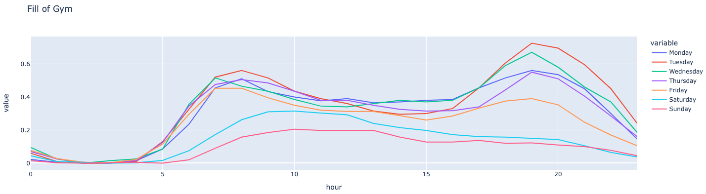

# Planet Fitness Data Request Project

## Overview
This project is designed to fetch data from a specified URL using Python's `requests` library and then write the fetched data along with the current timestamp to a CSV file named `planet-fitness.csv`. The project is useful for tracking and storing data over time for analysis or reporting purposes.

## Requirements
- Python 3.x
- `requests` library
- `csv` module
- `json` module
- `datetime` module from `datetime`

## Installation
1. Ensure Python 3.x is installed on your system.
2. Install the `requests` library using pip:

```
pip install requests
```

   
## Usage
To run the script, navigate to the project directory in your terminal and execute:
```
python planet-fitness-request.py
```
The script will continuously fetch data and append it to the `planet-fitness.csv` file along with the current timestamp until manually stopped.

## How It Works
1. The script defines a `get_data` function that sends a GET request to a specified URL with custom headers.
2. The response from the URL is parsed as JSON.
3. The `main` function is responsible for writing the fetched data and the current timestamp to a CSV file.
4. The script runs in an infinite loop, continuously fetching and writing data.

## Stopping the Script
To stop the script, use the keyboard shortcut `Ctrl + C` in the terminal.


## Example Output

## Note
This script is intended for educational purposes and should be used responsibly. Ensure you have permission to fetch data from the target URL and comply with any applicable terms of service.
